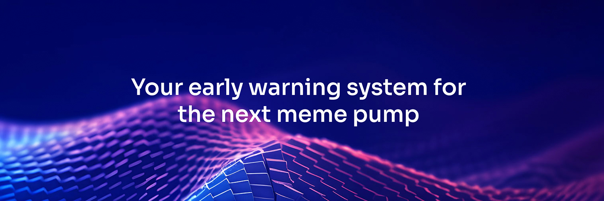
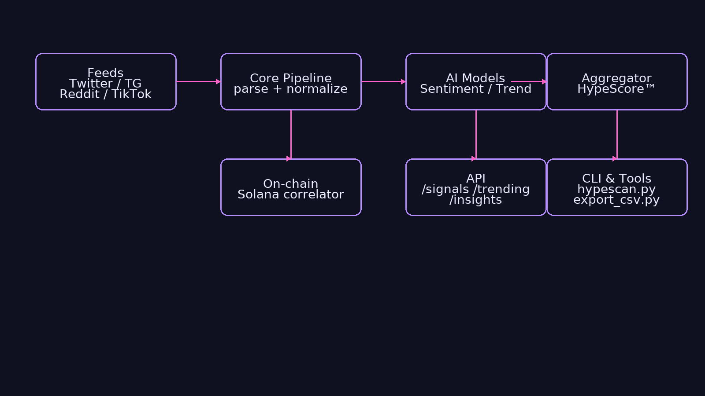

# ⚡ HypePulse AI

<p align="center">
  
</p>

<p align="center">
  <a href="https://shields.io"></a>
  <a href="#"></a>
  <a href="#"></a>
  <a href="#"></a>
  <a href="#"></a>

<p align="center">
  <a href="#"></a>
  <a href="#"></a>
  <a href="#"></a>
  <a href="#"></a>
  <a href="#"></a>
</p>

</p>

**AI radar for crypto hype.** Finding memes **before they pump** — across Twitter, Telegram, TikTok & Reddit.  
Your **early warning system** for the next meme pump.

---

## ✨ Features
- Real‑time **social scan** (X/Twitter, TG, TikTok, Reddit)
- Lightweight **NLP sentiment** + **HypeScore™**
- On‑chain **Solana** correlation (mints, LP add/remove, top holders)
- REST **API** (`/signals`, `/trending`, `/insights`), **CLI** tools, **scheduler**
- Pluggable **feeds** + YAML configs
- Examples for **Node.js**, **Python**, **curl**

---

## 🧭 Architecture

```
feeds --> core pipeline --> ai models --> aggregator --> API / CLI
  (twitter, tg, tiktok, reddit)       (sentiment, trend)   (scores, ranks)
                     \--> on-chain correlator (solana mints & LP)
```

<p align="center">
  
</p>

---

## 🚀 Quickstart

### 1) Node API
```bash
npm i
npm run dev
# http://localhost:3000/signals
```

### 2) Python tools
```bash
python3 -m venv .venv && source .venv/bin/activate
pip install -r requirements.txt
python cli/hypescan.py --source mock --minutes 30 --dump out/signals.json
```

### 3) Curl
```bash
curl http://localhost:3000/health
curl http://localhost:3000/signals
curl http://localhost:3000/insights/XYZ
```

---

## 🔧 Configuration
All inputs live in `configs/*.yaml` — enable/disable sources, API keys, thresholds.

```yaml
# configs/default.yaml
feeds:
  twitter: true
  telegram: true
  reddit: true
  tiktok: false
ai:
  sentiment_threshold: 0.25
  trend_window_minutes: 45
solana:
  rpc_url: https://example.quiknode.pro/xxx
  check_lp: true
hypescore:
  weights: {sentiment: 0.45, velocity: 0.35, onchain: 0.20}
```

---

## 🧠 Models
- `SentimentModel` — fast keyword & polarity hybrid
- `TrendModel` — velocity & burst detection
- `HypeScorer` — weighted blend → **HypeScore™ (0–100)**
- `Smoothing` — EMA/median smoothing for noisy feeds

---

## 📡 API Endpoints
- `GET /health` — service status
- `GET /signals` — top hype signals (token, HypeScore, reasons)
- `GET /trending` — trending mentions by source
- `GET /insights/:token` — detail breakdown, mini-timeline

```http
GET /signals -> 200
[
  { "token":"XYZ", "score":92, "reasons":["twitter velocity","positive TG"] },
  { "token":"ABC", "score":78, "reasons":["tiktok spike","on-chain mint"] }
]
```

---

## 📦 Examples

**Node.js**
```js
import fetch from "node-fetch";
const res = await fetch("http://localhost:3000/signals");
console.log(await res.json());
```

**Python**
```python
import requests
print(requests.get("http://localhost:3000/signals").json())
```

**curl**
```bash
curl http://localhost:3000/trending
```

---

## 🧪 Tests
`npm test` covers parsers, scoring, and API routes. Python utilities include simple doctests.

---

## 🗺 Roadmap
- v1 ✅: Social scan + HypeScore™
- v2 🔄: Realtime dashboard + sockets
- v3 🚀: Solana trading integration
- v4 📱: iOS/Android app

---

## 🤝 Contributing
Issues & PRs are welcome. See [CONTRIBUTING.md](CONTRIBUTING.md).

## 📜 License
MIT © 2025 HypePulse AI

**Follow us:** [Twitter](https://x.com/HypePulseAI)
